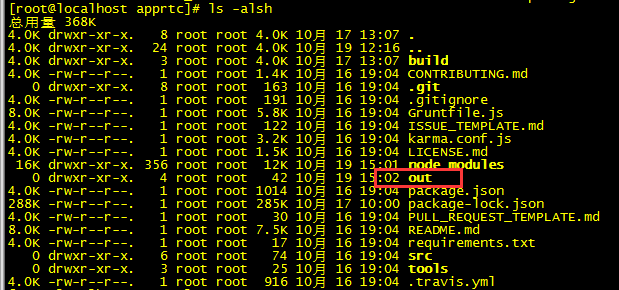
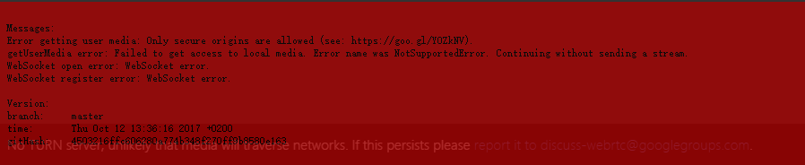

# CentOS 7 下安装WebRTC 

网上可以找到一堆WebRTC demo，在code.google.com上也能找到不少WebRTC应用项目的源码。有些demo是直接调用WebRTC API开发的，但大多数是调用上述两种WebRTC封装库开发的。由于WebRTC API的名称在不同浏览器及同一浏览器的不同版本之间存在差异，所以不是所有demo都能运行在所有浏览器上。Apprtc是一个使用WebRTC技术实现的一个在线聊天室，可以支持两个人进行视频通话，是一个不错的WebRTC demo。

运行AppRTC需要使用Google App Engine SDK for Python，因为这个项目的Web服务器是使用Google App Engine框架编写的，因此必须要安装。

同时还需要使用Grunt构建工具。

下面介绍如何在Centos 7上搭建AppRTC项目。


## <a name='toc'>目录</a>


1. [AppRTC的服务器组成](#apprtc-composition)
2. [准备工作](#preparation-works)
3. [翻墙](#vpn-setting)
4. [安装Google Engine SDK for Python](#gae-install)
5. [安装NodeJS](#nodejs-install)
6. [安装Grunt](#grunt-install)
7. [安装Open-JDK](#open-jdk-install)
8. [安装AppRTC](#apprtc-install)
9. [安装Collider](#collider-install)
10. [安装coTurn](#coTurn-install)
11. [配置Nginx服务器支持HTTPS](#nginx-https-supported)


## <a name='apprtc-composition'>一、AppRTC的服务器组成</a>

1. AppRTC - 房间服务器(Room Server)  https://github.com/webrtc/apprtc
  ​      房间服务器是用来创建和管理通话会话的状态维护,是双方通话还是多方通话,加入与离开房间等等。

2. Collider - 信令服务器(Signaling Server)  上面 Github 工程里自带，在 src/collider 下
  ​      信令服务器是用来管理和协助通话终端建立去中心的点对点通话的一个角色.这个角色要负责一下任务:
  ```
  - 用来控制通信发起或者结束的连接控制消息；
  - 发生错误时用来相互通告的消息；
  - 各自一方媒体流元数据，比如像解码器、解码器的配置、带宽、媒体类型等等；
  - 两两之间用来建立安全连接的关键数据；
  - 外界所能看到的网络上的数据，比如广域网IP地址、端口等。
  ```
   信令服务器的具体协议实现没有严格规定,只要实现功能就OK。

3. coTurn - 防火墙打洞(内网穿透)服务器(STUN/TURN/ICE Server)   https://github.com/coturn/coturn
  ​      我们目前大部分人连接互联网时都处于防火墙后面或者配置私有子网的家庭(NAT)路由器后面,这就导致我们的计算机的IP地址不是广域网IP地址,故而不能相互之间直接通讯。 正因为这样的一个场景,我们得想办法去穿越这些防火墙或者家庭(NAT)路由器,让两个同处于私有网络里的计算机能够通讯起来。

  ​     STUN(Simple Traversal of UDP over NATs,NAT 的UDP简单穿越); STUN协议服务器就是用来解决这些问题:

  ​       1) 探测和发现通讯对方是否躲在防火墙或者NAT路由器后面。

  ​       2) 确定内网客户端所暴露在外的广域网的IP和端口以及NAT类型等信息;STUN服务器利用这些信息协助不同内网的计算机之间建立点对点的UDP通讯.

  ​

  ​       STUN协议可以很好的解决一般家用(NAT)路由器环境的打洞问题,但是对于大部分的企业的网络环境就不是很好了。

  ​       这时需要一个新的解决方案:TURN（Traversal Using Relay NAT,允许在TCP或UDP的连线上跨越 NAT 
  或防火墙。TURN是一个Client-Server协议。TURN的NAT穿透方法与STUN类似，都是通过取得应用层中的公有地址达到NAT穿透,但实现TURN client的终端必须在通讯开始前与TURN server进行交互,并要求TURN server产生"relay port", 也就是relayed-transport-address.这时 TURN server会建立peer,即远端端点（remote endpoints）, 开始进行中继（relay）的动作,TURN client利用relay port将资料传送至peer,再由peer转传到另一方的TURN client.通过服务器新产生的peer来进行数据的中转.

  ​        ICE协议就是综合前面2种协议的综合性NAT穿越解决方案.

  ​       通过offer/answer模型建立基于UDP的通讯。ICE是offer/answer模型的扩展，通过在offer和answer的SDP(Session Description Protocol)里面包含多种IP地址和端口，然后对本地SDP和远程SDP里面的IP地址进行配对，然后通过P2P连通性检查进行连通性测试工作，如果测试通过即表明该传输地址对可以建立连接。其中IP地址和端口（也就是地址）有以下几种：本机地址、通过STUN服务器反射后获取的server-reflexive地址（内网地址被NAT映射后的地址）、relayed地址（和TURN转发服务器相对应的地址）及Peer reflexive地址等。

4. 需要自己实现coTurn连接信息接口，主要返回用户名、密码和turn配置信息，通常叫做TURN REST API,不实现这个接口的话AppRTCDemo连不上服务器，浏览器访问的话可以正常访问。

## <a name='preparation-works'>二、准备工作</a>

1. AppRTC 依赖 [Google App Engine SDK for Python](https://cloud.google.com/appengine/downloads#Google_App_Engine_SDK_for_Python)离线版本,[Node.js](https://nodejs.org) 和 [Grunt](http://gruntjs.com/)。
   GAE SDK 安装很简单：下载、解压、添加到PATH环境变量即可完成。（谷歌已经关闭新应用的申请，不过好像不影响使用）
   grunt，是 Node.js 下的一套任务执行系统，经过 Gruntfile.js 的配置，可以做很多事情。首先安装 Node.js。使用 nvm 可以很方便的为自己的 Linux 账户安装并设置好 Node.js。（而后，你可以选择安装 cnpm，这样就可以使用国内的缓存节点，比npm install 命令会快许多，如果你只用这一次 grunt，那么不装这个也是可以的。）接下来只需要执行一个 npm install -g grunt-cli 即可安装好 grunt。
2. Collider 依赖 golang。尿性的问题来了：墙……安装 golang 和日后使用 golang 所需的包，几乎都要翻墙。所以这里解决掉墙这个问题后，再使用 gvm 安装 golang 即可完成我们的准备工作。

## <a name='vpn-setting'>三、翻墙</a>

#### 方法一：安装vpn（Virtual PrivateNetwork:虚拟个人专用网络）

vpn下载地址：https://www.expressvpn.com/support/vpn-setup/app-for-linux/#download (已被墙)

主要用于员工去外地出差，还想访问公司内网，而本文用vpn是为了在国内访问国外网站，从国外网站下载配置apprtc所需要的包。

1. 安装expressvpn:

   ```shell
   [root@localhost src]# uname -m  #确认linux版本
   x86_64
   [root@localhost src]# sudo yum install expressvpn-1.1.0-1.x86_64.rpm
   ```

2. 激活vpn（这个激活码需要购买）：

   ```shell
   [root@localhost src]# expressvpn activate
   ```

3. 连接vpn：

```shell
[root@localhost src]# expressvpn connect
```
4. 断开vpn：

```shell
[root@localhost src]# expressvpn disconnect
```

#### 

#### 方法二：修改/etc/hosts来翻墙

修改/etc/hosts来翻墙，简单快捷，翻墙host的git地址： [https://github.com/racaljk/hosts/blob/master/hosts#L2](https://github.com/racaljk/hosts/blob/master/hosts#L2)

## <a name='gae-install'>四、安装Google Engine SDK for Python</a>

官网地址：https://cloud.google.com/appengine/downloads#Google_App_Engine_SDK_for_Python

Google Engine SDK for Python 使用的是Python 2.7。因此在安装Google Engine SDK for Python之前，我们必须安装Python 2.7。

#### 安装Python 2.7 （因CentOS 7 已预装 Python 2.7.5，可略过此步骤）

1. 安装Python 2.7.12:

  ```shell
   [root@localhost src]# wget wget https://www.python.org/ftp/python/2.7.12/Python-2.7.12.tgz
   [root@localhost src]# tar -zxvf Python-2.7.12.tgz
   [root@localhost src]# cd Python-2.7.12
   [root@localhost Python-2.7.12]# ./configure
   [root@localhost Python-2.7.12]# make
   [root@localhost Python-2.7.12]# make install
  ```

2. 配置Python 2.7:

  建立软连接，使系统默认的 python指向 python2.7：

  ```shell
  [root@localhost Python-2.7.12]# mv /usr/bin/python /usr/bin/python2.6.6
  [root@localhost Python-2.7.12]# ln -s /usr/local/bin/python2.7 /usr/bin/python
  ```

3. 系统 Python 软链接指向 Python2.7 版本后，yum不能正常工作，我们需要指定 yum 的Python版本

   ```shell
    [root@localhost Python-2.7.12]# vi /usr/bin/yum
   ```

   将文件头部的：
   ```shell
   #!/usr/bin/python
   ```
   改成：
   ```shell
   #!/usr/bin/python2.6.6
   ```
#### 安装Google Engine SDK for Python

1. 下载Google App Engine SDK for Python源码:
   ```shell
   [root@localhost src]# wget https://storage.googleapis.com/appengine-sdks/featured/google_appengine_1.9.40.zip
   ```

2. 解压:
   ```shell
   [root@localhost src]# yum install -y unzip zip #若未装unzip和zip
   [root@localhost src]# unzip google_appengine_1.9.40.zip -d /usr/local/
   ```

3. 将解压后的目录添加到环境变量中:

   ```shell
   [root@localhost src]# vi /etc/profile
   ```

   将其打开把:

   ```shell
   export PATH=$PATH:/usr/local/google_appengine
   ```
   这句放在“export PATH USER LOGNAME MAIL HOSTNAME HISTSIZE INPUTRC”的上一行。

   要立即生效环境配置，不需要重启，用下命令：
   ```shell
   [root@localhost src]# . /etc/profile
   ```
   配置成功之后我们就可以在命令行中使用dev_appserver.py了

## <a name='apprtc-composition'>五、安装NodeJS</a>

```shell
[root@localhost src]# wget https://nodejs.org/dist/v8.7.0/node-v8.7.0.tar.gz
[root@localhost src]# tar -zxvf node-v8.7.0.tar.gz
[root@localhost src]# cd node-v8.7.0
[root@localhost node-v8.7.0]# ./configure
[root@localhost node-v8.7.0]# make
[root@localhost node-v8.7.0]# make install
[root@localhost node-v8.7.0]# ln -fs /usr/local/bin/node /sbin/node #让所有用户都可用node
[root@localhost node-v8.7.0]# node -v #测试node是否安装成功
```
  或使用yum安装：
   ```shell
[root@localhost src]# yum install -y nodejs
   ```

## <a name='grunt-install'>六、安装Grunt</a>

#### 安装CNPM

在中国大陆的话，因为网络原因，我们可能需要使用cnpm：

```shell
[root@localhost src]# npm install -g cnpm --registry=https://registry.npm.taobao.org
```

#### 安装Grunt
```shell
[root@localhost src]# npm -g install grunt-cli
```
如果在中国大陆不能正常安装的话，尝试使用cnpm安装，即：
```shell
[root@localhost src]# cnpm -g install grunt-cli
```
## <a name='open-jdk-install'>七、安装Open-JDK</a>
Apprtc这个项目还需要JAVA环境，因此我们还需要配置一下Java环境。这里我使用的是Open-JDK

官网:http://openjdk.java.net/

1. 安装Open-JDK：

```shell
[root@localhost src]# yum install java-1.8.0-openjdk
```

2. 配置环境变量:

Redhat公司提供的OpenJDK环境变量配置参考文章:<https://access.redhat.com/documentation/en-US/JBoss_Enterprise_Application_Platform/6/html/Installation_Guide/Install_OpenJDK_on_Red_Hat_Enterprise_Linux.html>

```shell
[root@localhost src]# vi ~/.bashrc
```

将其打开把:

```shell
export JAVA_HOME=/usr/lib/jvm/java-1.8.0-openjdk-1.8.0.144-0.b01.el7_4.x86_64/jre
```

这句放在最后一行。

要立即生效环境配置，不需要重启，用下命令：

```shell
[root@localhost src]# source  ~/.bashrc
```

## <a name='apprtc-install'>八、安装AppRTC</a>
#### 安装git（若已安装，可略过此步骤）

```shell
[root@localhost src]# yum install git
[root@localhost src]# git --version  #测试git是否安装成功
```
或通过编译安装：
```shell
[root@localhost src]# wget https://git-core.googlecode.com/files/git-1.9.0.tar.gz
[root@localhost src]# tar -zxvf git-1.9.0.tar.gz
[root@localhost src]# cd git-1.9.0
[root@localhost git-1.9.0]# ./configure --prefix=/usr/local/git
[root@localhost git-1.9.0]# make
[root@localhost git-1.9.0]# make install
[root@localhost git-1.9.0]# git --version  #测试git是否安装成功
```
添加git到环境变量：
```shell
[root@localhost src]# vi /etc/profile
```
将其打开把：
```shell
export PATH=$PATH:/usr/local/git/bin:/usr/local/git/libexec/git-core
```
这句放在“export PATH USER LOGNAME MAIL HOSTNAME HISTSIZE INPUTRC”的上一行。
（因为bin目录只有4个命令，其它的几十个命令在libexec/git-core目录下，所以，在PATH搜索路径下，也要加上才能找到）
立即生效环境配置，不需要重启，用下命令：
```shell
[root@localhost src]# . /etc/profile
```
#### 获取 AppRTC 源码并安装项目依赖：
```shell
[root@localhost src]# git clone https://github.com/webrtc/apprtc.git
[root@localhost src]# cd apprtc
[root@localhost apprtc]# cnpm install
```

#### 修改配置文件：

主要是src/app_engine目录下的apprtc.py和constants.py文件。对于src/app_engine目录下的文件每次修改后需执行命令grunt build重新编译。

**修改constants.py**

```shell
[root@localhost apprtc]# vi /usr/local/src/apprtc/src/app_engine/constants.py
#TURN_BASE_URL = 'https://computeengineondemand.appspot.com'
TURN_BASE_URL = 'https://192.168.9.223'  #这个是coturn所对应的连接信息接口的地址
#TURN_URL_TEMPLATE = '%s/turn?username=%s&key=%s'
TURN_URL_TEMPLATE = '%s/turn.php?username=%s&key=%s' #如果turn.php未实现，可使用默认配置
#CEOD_KEY = '4080218913'
CEOD_KEY = 'bovin'  #这里要和coturn的turnserver.conf中static-auth-secret的值一致

#ICE_SERVER_BASE_URL = 'https://networktraversal.googleapis.com'
ICE_SERVER_BASE_URL = 'https://192.168.9.223'
#ICE_SERVER_URL_TEMPLATE = '%s/v1alpha/iceconfig?key=%s'
ICE_SERVER_URL_TEMPLATE = '%s/iceconfig.php?key=%s'  #如果iceconfig.php未实现，可用默认配置，但是Android Apk会有问题

#将WSS_INSTANCE_HOST_KEY改为信令服务器可访问的地址，不需要协议，没有URL
WSS_INSTANCES = [{
    #WSS_INSTANCE_HOST_KEY: 'apprtc-ws.webrtc.org:443',
    WSS_INSTANCE_HOST_KEY: '192.168.9.223:8089',
    WSS_INSTANCE_NAME_KEY: 'wsserver-std',
    WSS_INSTANCE_ZONE_KEY: 'us-central1-a'
}, {
    #WSS_INSTANCE_HOST_KEY: 'apprtc-ws-2.webrtc.org:443',
    WSS_INSTANCE_HOST_KEY: '192.168.9.223:8089',
    WSS_INSTANCE_NAME_KEY: 'wsserver-std-2',
    WSS_INSTANCE_ZONE_KEY: 'us-central1-f'
}]
```


**~~修改apprtc.py~~**

```shell
[root@localhost apprtc]# vi /usr/local/src/apprtc/src/app_engine/apprtc.py
 if wss_tls and wss_tls == 'false':
    wss_url = 'ws://' + wss_host_port_pair + '/ws'
    wss_post_url = 'http://' + wss_host_port_pair
  else:
    wss_url = 'wss://' + wss_host_port_pair + '/ws'
    #wss_url = 'ws://' + wss_host_port_pair + '/ws'
    wss_post_url = 'https://' + wss_host_port_pair
    #wss_post_url = 'http://' + wss_host_port_pair

def make_pc_config(ice_transports):
  config = {
  'iceServers': [],
  #'iceServers': [{"urls":"stun:192.168.9.223"},{"urls":"turn:bovin@192.168.9.223","credential":"apprtc666"}],
  'bundlePolicy': 'max-bundle',
  'rtcpMuxPolicy': 'require'
  };

  if ice_transports:
    config['iceTransports'] = ice_transports
  return config
```

~~把原来的wss和https的scheme都改为ws和http，不要让客户端或者浏览器去使用SSL链接。若有第三方根证书的签名机构颁发的证书可忽略。~~

注：**最新的apprtc版本 apprtc.py文件不需要修改**


#### 构建Apprtc项目：

```shell
[root@localhost apprtc]# grunt build
```

常见错误：requests模块不存在

```shell
Running "shell:buildAppEnginePackage" (shell) task
Traceback (most recent call last):
  File "./build/build_app_engine_package.py", line 12, in <module>
    import requests
ImportError: No module named requests
Warning: Command failed: python ./build/build_app_engine_package.py src out/app_engine
Traceback (most recent call last):
  File "./build/build_app_engine_package.py", line 12, in <module>
    import requests
ImportError: No module named requests
 Use --force to continue.

Aborted due to warnings.
```

解决方法：通过python的包管理工具pip来安装requests

#### 安装pip

pip类似RedHat里面的yum，安装Python包非常方便。

1. 下载并安装setuptools：
```shell
[root@localhost src]# wget --no-check-certificate https://bootstrap.pypa.io/ez_setup.py
[root@localhost src]# python ez_setup.py --insecure
```
2. 安装pip:
  到[python官网](https://pypi.python.org/pypi/pip)下载pip安装包安装

```shell
[root@localhost src]# wget https://pypi.python.org/packages/11/b6/abcb525026a4be042b486df43905d6893fb04f05aac21c32c638e939e447/pip-9.0.1.tar.gz#md5=35f01da33009719497f01a4ba69d63c9
[root@localhost src]# tar -zxvf pip-9.0.1.tar.gz
[root@localhost src]# cd pip-9.0.1
[root@localhost pip-9.0.1]# sudo python setup.py install
[root@localhost pip-9.0.1]# pip -V #测试pip是否安装成功
```

#### 安装requests模块

```shell
[root@localhost src]# pip install requests
```

#### 再次构建Apprtc项目：

```shell
[root@localhost src]# cd apprtc
[root@localhost apprtc]# grunt build
[root@localhost apprtc]# chmod -R 777 ./out
```

构建成功会出现了out文件夹，如下：



#### 运行Apprtc(务必使用sudo)

```shell
[root@localhost apprtc]# sudo dev_appserver.py --host 192.168.9.223 --port 8080 --admin_host 192.168.9.223 /usr/local/src/apprtc/out/app_engine
INFO     2017-10-19 04:10:11,422 sdk_update_checker.py:229] Checking for updates to the SDK.
INFO     2017-10-19 04:10:32,452 sdk_update_checker.py:245] Update check failed: <urlopen error timed out>
INFO     2017-10-19 04:10:32,492 api_server.py:205] Starting API server at: http://localhost:42757
INFO     2017-10-19 04:10:32,498 dispatcher.py:197] Starting module "default" running at: http://192.168.9.223:8080
INFO     2017-10-19 04:10:32,499 admin_server.py:116] Starting admin server at: http://192.168.9.223:8000
ERROR    2017-10-19 04:15:39,486 wsgi.py:263] 
```

报错：INFO     2017-10-19 04:10:32,452 sdk_update_checker.py:245] Update check failed: <urlopen error timed out>

原因：没开vpn，连不上谷歌的内容，打开vpn，再次运行即可。

注：dev_appserver.py 是/usr/local/google_appengine目录下的文件，已经配置在环境变量中。

浏览器中打开http://192.168.9.223:8080访问，服务器报以下错误：



原因：Starting with Chrome 47, getUserMedia() requests are only allowed from secure origins: HTTPS or localhost. `getUserMedia`needs HTTPS to work. You'll have to implement HTTPS for your webserver. `localhost` is the only domain allowed to use `getUserMedia` without HTTPS.

解决：You can setup a self signed ssl certificate for the local webserver and then you can access with `https://192.168.9.223:<https port>`

如果要外网访问，加上host和端口，如：dev_appserver.py --host 121.40.28.178 --port 80 --admin_host 121.40.28.178  /usr/local/src/apprtc/out/app_engine

参照上面的配置，在浏览器中打开http://121.40.28.178即可访问 。

注：需检查80、8080和8000端口是否已开启，若未开启，则开启之：

```shell
[root@localhost src]# firewall-cmd --zone=public --add-port=80/tcp --permanent
[root@localhost src]# firewall-cmd --zone=public --add-port=443/tcp --permanent #用于 ICE Server
[root@localhost src]# firewall-cmd --zone=public --add-port=3478/tcp --permanent #用于 ICE Server
[root@localhost src]# firewall-cmd --zone=public --add-port=3478/udp --permanent #用于 ICE Server
[root@localhost src]# firewall-cmd --zone=public --add-port=8000/tcp --permanent #用于 Room admin server
[root@localhost src]# firewall-cmd --zone=public --add-port=8080/tcp --permanent #用于 Room Server
[root@localhost src]# firewall-cmd --zone=public --add-port=8089/tcp --permanent #用于 Signal Server
[root@localhost src]# firewall-cmd --zone=public --add-port=49152-65535/tcp --permanent #用于 TURN/STUN Server
[root@localhost src]# firewall-cmd --reload   #重启防火墙，使开启的端口生效
[root@localhost src]# firewall-cmd --permanent --query-port=80/tcp  #查询是否已开启的80端口
```

注：3478 和 59000-65000 用于 TURN/STUN Server，注意一定要开放 3478 udp 端口，否则 STUN Binding 请求进不去；

## <a name='collider-install'>九、安装Collider</a>

Collider是Google Chrome WebRTC项目里提供的用GO语言编写的基于WebSocket的信令服务器，也是Apprtc这个项目配套的一个信令服务器。在我们的Apprtc项目中就已经携带了它的源码。在安装collider之前，我们必须先安装Golang。

#### 安装Golang

go标准包安装：

```shell
[root@localhost src]# wget https://studygolang.com/dl/golang/go1.9.1.linux-amd64.tar.gz
[root@localhost src]# tar -zxvf go1.9.1.linux-amd64.tar.gz -C /usr/local
[root@localhost src]# mkdir -p /usr/local/gopath
```

添加go到环境变量：

```shell
[root@localhost src]# vim /etc/profile 
```

将其打开把：

```shell
export GOROOT=/usr/local/go
export GOPATH=/usr/local/gopath
export PATH=$PATH:$GOROOT/bin:$GOPATH/bin
```

这句放在“export PATH USER LOGNAME MAIL HOSTNAME HISTSIZE INPUTRC”的上一行。
立即生效环境配置，不需要重启，用下命令：

```shell
[root@localhost src]# . /etc/profile
[root@localhost src]# go version #测试go是否安装成功
```

注：GOPATH环境变量用来指定你的工作目录。当我们在开发Golang项目的时候需要指定

> The GOPATH environment variable specifies the location of your workspace. It is likely the only environment variable you'll need to set when developing Go code.
> GOPATH环境变量用来指定除GOROOT之外包含的Go项目源代码和二进制文件的目录。go install和go工具都会用到GOPATH,作为编译后二进制文件的存放目的地和import包时的搜索路径。

GOPATH是一个路径列表，也就是可以同时指定多个目录。多个目录在Mac和Linux下通过”:”分割；Windows下通过”;”分割。注意，大部分情况下会是第一个路径优先。

$GOPATH 目录约定有三个子目录：

- src 存放源代码（比如：.go .c .h .s等）
- pkg 编译后生成的文件（比如：.a）
- bin 编译后生成的可执行文件（为了方便，可以把此目录加入到 $PATH 变量中，如果有多个gopath，那么使用${GOPATH//://bin:}/bin添加所有的bin目录）

或yum安装：

```shell
[root@localhost src]# yum remove golang
[root@localhost src]# yum -y install golang
[root@localhost src]# go version #测试go是否安装成功
```

#### 构建

1. Checkout  `apprtc` 库

   ```shell
   [root@localhost src]# git clone https://github.com/webrtc/apprtc.git
   ```

2. 创建 $GOPATH 的src目录

   E.g. 

   ```shell
   [root@localhost src]# export GOPATH=/usr/local/gopath
   [root@localhost src]# mkdir $GOPATH/src
   ```

3. 将collider的源码目录链接到 `$GOPATH/src`

   ```shell
   [root@localhost src]# ln -fs /usr/local/src/apprtc/src/collider/collider $GOPATH/src
   [root@localhost src]# ln -fs /usr/local/src/apprtc/src/collider/collidermain $GOPATH/src
   [root@localhost src]# ln -fs /usr/local/src/apprtc/src/collider/collidertest $GOPATH/src
   ```

4. 安装collidermain项目依赖

   ```shell
   [root@localhost src]# go get -v collidermain
   ```
   报错：
   ```shell
   Fetching https://golang.org/x/net/websocket?go-get=1
   https fetch failed: Get https://golang.org/x/net/websocket?go-get=1: dial tcp 216.239.37.1:443: i/o timeout
   package golang.org/x/net/websocket: unrecognized import path "golang.org/x/net/websocket" (https fetch: Get https://golang.org/x/net/websocket?go-get=1: dial tcp 216.239.37.1:443: i/o timeout)
   ```
   原因：因为golang.org被墙，国内使用 go get 安装 golang 官方包会失败。

   不翻墙的情况下怎么解决这个问题？其实 golang 在 github 上建立了一个[镜像库](https://github.com/golang)，如 <https://github.com/golang/net> 即是 <https://golang.org/x/net> 的镜像库。

   获取 golang.org/x/net 包，其实只需要以下步骤：

   ```shell
   [root@localhost src]# mkdir -p $GOPATH/src/golang.org/x
   [root@localhost src]# cd $GOPATH/src/golang.org/x
   [root@localhost src]# git clone https://github.com/golang/net.git
   [root@localhost src]# go install net
   ```

   安装其它依赖类似。

   如果上面命令仍失败,那么则可用下面这个麻烦的方法安装GO环境的websocket包：

   ```shell
   [root@localhost src]# cd $GOPATH/src
   [root@localhost src]# wget http://www.golangtc.com/static/download/packages/golang.org.x.net.tar.gz
   [root@localhost src]# tar -zxvf golang.org.x.net.tar.gz
   [root@localhost src]# go install golang.org/x/net/websocket/
   ```

   这样collidermain的项目依赖就安装完了。

5. 安装 `collidermain`

   ```shell
   [root@localhost src]# go install collidermain
   [root@localhost src]# collidermain --help #测试collidermain是否安装成功
   ```

#### 运行（启动colider）

```shell
[root@localhost src]# $GOPATH/bin/collidermain -port=8089 -tls=true
若想后台运行，则执行：
[root@localhost src]# nohup $GOPATH/bin/collidermain -port=8089 -tls=true &
[root@localhost src]# netstat -tunlp #
[root@localhost src]# ps -ef |grep collidermain
```

注：-tls=true，表示需要证书。这里指定端口为8089，因为其默认是443，而nginx监听的ssl默认端口也为443，会造成冲突。

#### 测试

```shell
[root@localhost src]# go test collider
```

#### 部署

1. 修改房间服务器IP。即修改 [roomSrv](https://github.com/webrtc/apprtc/blob/master/src/collider/collidermain/main.go#L16) 为 你的apprtc服务器实例， e.g.

```shell
[root@localhost src]# vi /usr/local/src/apprtc/src/collider/collidermain/main.go
```

找开修改下面一行

```go
var roomSrv = flag.String("room-server", "https://192.168.9.223:8080", "The origin of the room server")
```
2. 修改证书地址：

```shell
[root@localhost src]# vi /usr/local/src/apprtc/src/collider/collider/collider.go
```

找开修改下面一行

```go
e = server.ListenAndServeTLS("/cert/cert.pem", "/cert/key.pem")
```

为：

```go
e = server.ListenAndServeTLS("/usr/local/cert/turn_server_cert.pem", "/usr/local/cert/turn_server_pkey.pem")
```

3. 然后重复上面构建部分的步骤5。

#### 安装Collider

1. 登录将要运行Collider的机器。
2. 创建一个Collider目录，这里假设它是创建在根目录 中的 (`/usr/local/collider`)。
```shell
[root@localhost src]# mkdir -p /usr/local/collider
```
3. 创建一个证书目录, 这里假设它是创建在根目录 中的 (`/usr/local/cert`)。
```shell
[root@localhost src]# mkdir -p /usr/local/cert
```
4. 从你的开发机器中拷贝`$GOPATH/bin/collidermain ` 到要运行Collider的机器的`/usr/local/collider` 目录中。
```shell
[root@localhost src]# cp -R /usr/local/gopath/bin/collidermain /usr/local/collider
```
#### 证书

如果你打算部署在生产环境，你应该使用证书，这样你就可以使用安全的websockets。把文件`cert.pem` 和 `key.pem` 放到目录 `/usr/local/cert/`中。 E.g. `/usr/local/cert/cert.pem` and `/usr/local/cert/key.pem`

#### 自动启动

1\. 创建脚本文件 `/usr/local/collider/start.sh` ，写入以下内容:

```bash
#!/bin/sh -
/usr/local/collider/collidermain -port=8089 -tls=true 2>> /usr/local/collider/collider.log
```

2\. 运行命令`chmod 744 /usr/local/collider/start.sh`使用其可以执行。

#### 如果使用inittab按下面操作 ，否则跳到下面第5步:

3\. 将下面一行添加到 `/etc/inittab` ，以允许Collider进程自动启动 (确保要么添加了 系统用户`coll`，要么将其替换为运行collider的用户):
```bash
coll:2:respawn:/usr/local/collider/start.sh
```
4\. 运行命令 `init q` 使用inittab的改变在不重启系统的情况下生效。

#### 如果使用systemd:

5\. 通过 `sudo nano /lib/systemd/system/collider.service`命令创建一个服务，并添加以下内容:

```
[Unit]
Description=AppRTC signalling server (Collider)
 
[Service]
ExecStart=/usr/local/collider/start.sh
StandardOutput=null
 
[Install]
WantedBy=multi-user.target
Alias=collider.service
```
注：若未安装nano，可使用以下命令安装之：
```shell
[root@localhost src]# yum install nano
```
6\. 启用服务:

```shell
[root@localhost src]# sudo systemctl enable collider.service #开机运行服务
[root@localhost src]# sudo systemctl start collider.service #启动服务
```

7\. 验证它的启动和运行:

```shell
[root@localhost src]# sudo systemctl status collider.service
```

#### 日志轮循设置

要启用日志轮循文件 `/usr/local/collider/collider.log` ，需添加以下内容到文件 `/etc/logrotate.d/collider` 中:

```
/usr/local/collider/collider.log {
    daily
    compress
    copytruncate
    dateext
    missingok
    notifempty
    rotate 10
    sharedscripts
}
```

这些日志每天轮循，10天后删除。 归档日志在 `/usr/local/collider`。

## <a name='coTurn-install'>十、安装coTurn</a>

coTurn是一个C/C++语言的开源项目,项目地址: <https://code.google.com/p/coturn/> 或者我们直接下载已经编译好的软件包，打开这个网址: <http://turnserver.open-sys.org/downloads/> 找到适合自己Linux系统的下载即可。

#### 安装coTurn

```shell
[root@localhost src]# wget http://turnserver.open-sys.org/downloads/v4.5.0.6/turnserver-4.5.0.6-CentOS7.2-x86_64.tar.gz
[root@localhost src]# tar -zxvf turnserver-4.5.0.6-CentOS7.2-x86_64.tar.gz -C /usr/local
[root@localhost src]# mv /usr/local/turnserver-4.5.0.6 /usr/local/turnserver
[root@localhost src]# cd /usr/local/turnserver
[root@localhost turnserver]# ./install.sh
```

#### 生成签名证书

生成的证书在/usr/local/cert/目录下：

```shell
[root@localhost turnserver]# sudo openssl req -x509 -newkey  rsa:2048 -keyout /usr/local/cert/turn_server_pkey.pem -out /usr/local/cert/turn_server_cert.pem -days 99999 -nodes
```

#### 生成TurnServer用户名和密码

命令格式：turnadmin -k -u 用户名 -r north.gov -p 密码

```shell
[root@localhost turnserver]# turnadmin -k -u bovin -r north.gov -p apprtc666
```

​        -k 表示生成一个long-term credential key 

​        -u 表示用户名 

​        -p 表示密码 

​        -r 表示Realm域，（这个值的设置可能会有影响）

复制保存一下生成出来的key，此处我的为：0x8894ae0fa69d69b54fbc7c4810a04660

#### 编辑配置文件

```shell
[root@localhost turnserver]# vim /etc/turnserver/turnserver.conf
```

将其打开，修改内容如下：

```
listening-device=eth0
relay-device=eth0

# 记得开启端口
#min-port=49152
#max-port=65535

# 是否取消TURN服务器运行'extra'详细模式。
# 这种模式是非常恼人的,产生大量的输出。
# 在任何正常情况下不建议。
# 更详细的输出日志
Verbose

# 是否取消在TURN消息中使用指纹。
# 默认情况下,指纹是关闭的。
# WebRTC 的消息里会用到
fingerprint

# 是否取消使用长期证书机制。
# 默认情况下不使用凭证机制(允许任何用户)。
# 这个选项可能使用用户数据文件或PostgreSQL或MySQL或Redis来存储用户密钥。
# WebRTC 认证需要
lt-cred-mech

# REST API 认证需要
use-auth-secret

# REST API 加密所需的 KEY
# 这里我们使用“静态”的 KEY，Google 自己也用的这个
# static-auth-secret=4080218913
static-auth-secret=bovin
user=bovin:0x8894ae0fa69d69b54fbc7c4810a04660   #（替换成上一步通过turnadmin生成的key）
user=bovin:apprtc666

# TURN REST API的长期凭证机制范围。
# 用户登录域
#realm=

# 可为 TURN 服务提供更安全的访问
stale-nonce=600

# 签名证书
cert=/usr/local/cert/turn_server_cert.pem
pkey=/usr/local/cert/turn_server_pkey.pem

# 屏蔽 loopback, multicast IP地址的 relay
no-loopback-peers
no-multicast-peers

# 启用 Mobility ICE 支持
mobility

# 禁用本地 telnet cli 管理接口
no-cli
```

（查看[turnserver.conf文件详解](./turnserver.conf_introduction.md) ）

#### 启动coturn服务器

```shell
[root@localhost turnserver]# systemctl start turnserver
[root@localhost turnserver]# systemctl status turnserver #查询turnserver服务运行状态
```

#### 测试

在浏览器访问http://外网ip:3478,如果看到“TURN Server”，说明已经搭好了。

{:height="172px" width="623px"}

## <a name='nginx-https-supported'>十一、配置Nginx服务器支持HTTPS</a>

最后一步就是配置Nginx反向代理服务器，提供默认HTTPS的访问，新建Nginx虚拟主机配置文件，反向代理到8080端口。

#### 安装Nginx

此处不多说。

#### HTTPS简介

**什么是https?**

超文本传输安全协议（英语：Hypertext Transfer Protocol Secure，缩写：HTTPS，也被称为HTTP overTLS，HTTP over SSL或HTTP Secure）是一种网络安全传输协议。在计算机网络上，HTTPS经由超文本传输协议进行通信，但利用SSL/TLS来对数据包进行加密。HTTPS开发的主要目的，是提供对网络服务器的身份认证，保护交换数据的隐私与完整性。(来源：维基百科）

HTTPS其实是有两部分组成：HTTP + SSL / TLS，也就是在HTTP上又加了一层处理加密信息的模块。服务端和客户端的信息传输都会通过TLS进行加密，所以传输的数据都是加密后的数据。

**https协议原理**

首先，客户端与服务器建立连接，各自生成私钥和公钥，是不同的。服务器返给客户端一个公钥，然后客户端拿着这个公钥把要搜索的东西加密，称之为密文，并连并自己的公钥一起返回给服务器，服务器拿着自己的私钥解密密文，然后把响应到的数据用客户端的公钥加密，返回给客户端，客户端拿着自己的私钥解密密文，把数据呈现出来。

#### 开启nginx的ssl模块

默认情况下ssl模块并未被安装，如果要使用该模块则需要在编译时指定--with-http_ssl_module参数。若未安装，可按以下步骤安装：

```shell
[root@localhost ~]# cd /usr/local/src/nginx-1.13.6
[root@localhost nginx-1.13.6]# ./configure --user=nginx --group=www --prefix=/usr/local/nginx --with-http_stub_status_module --with-http_gzip_static_module --with-pcre --with-http_ssl_module
[root@localhost nginx-1.13.6]# make #不需要make install安装。否则会覆盖
```

备份原有已经安装好的nginx：

```shell
[root@localhost nginx-1.13.6]# cp /usr/local/nginx/sbin/nginx /usr/local/nginx/sbin/nginx.bak
```

将刚刚编译好的nginx覆盖掉原来的nginx(ngixn必须先停止)：

```shell
[root@localhost nginx-1.13.6]# /usr/local/nginx/sbin/nginx -s stop
[root@localhost nginx-1.13.6]# cp -f ./objs/nginx /usr/local/nginx/sbin/
```

启动nginx，查看nginx模块是否已经添加：

```shell
[root@localhost nginx-1.13.6]# /usr/local/nginx/sbin/nginx
[root@localhost nginx-1.13.6]# /usr/local/nginx/sbin/nginx -V
```

#### 证书和私钥的生成

默认情况下ssl模块并未被安装，如果要使用该模块则需要在编译时指定--with-http_ssl_module参数。若未安装，可按以下步骤安装：

1.   进入你想创建证书和私钥的目录：

```shell
[root@localhost nginx-1.13.6]# mkdir -p /usr/local/nginx/conf/ssl
[root@ nginx-1.13.6]# cd /usr/local/nginx/conf/ssl
```

注意：生成的目录一般放在nginx/conf/ssl目录。

2. 创建服务器私钥(服务器证书密钥文件)server.key：

```shell
[root@localhost ssl]# openssl genrsa -des3 -out server.key 1024
Generating RSA private key, 1024 bit long modulus
..++++++
..........++++++
e is 65537 (0x10001)
Enter pass phrase for server.key:
Verifying - Enter pass phrase for server.key:
```

输入密码，确认密码，自己随便定义，但是要记住，后面会用到。

3. 创建签名请求的证书（服务器证书的申请文件）（CSR）server.csr：
```shell
[root@localhost ssl]# openssl req -new -key server.key -out server.csr
```

输出内容为：
```shell
Enter passphrase for server.key: ← 输入前面第2步创建的密码
You are aboutto be asked to enter information that will be incorporated
into yourcertificate request.
What you areabout to enter is what is called a Distinguished Name or a DN.
There are quitea few fields but you can leave some blank
For some fieldsthere will be a default value,
If you enter'.', the field will be left blank.
-----
CountryName (2 letter code) [XX]:CN ← 国家代号，中国输入CN
Stateor Province Name (full name) []:Guangdong ←省的全名，拼音
LocalityName (eg, city) [Default City]:Shenzhen ←市的全名，拼音
OrganizationName (eg, company) [Default Company Ltd]:Richinfo Corp. ← 公司英文名
OrganizationalUnit Name (eg, section) []:front-end ←可以不输入
CommonName (eg, your name or your server's hostname) []:bovin← 此时不输入
EmailAddress []:bovin.phang@gmail.com ← 电子邮箱，可随意填
Pleaseenter the following 'extra' attributes
tobe sent with your certificate request
Achallenge password []: ← 可以不输入
An optionalcompany name []: ← 可以不输入
```
4. 备份一份服务器密钥文件：
```shell
[root@localhost ssl]# cp server.key server.key.org
```


5. 去除文件口令（在加载SSL支持的Nginx并使用上述私钥时除去必须的口令）：
```shell
[root@localhost ssl]# openssl rsa -in server.key.org -out server.key
```
注意到这边的key是nopassword的，就是重启nginx的时候，不需要输入密码。

6. 生成证书文件（标记证书使用上述私钥和CSR）server.crt：
```shell
[root@localhost ssl]# openssl x509 -req -days 365 -in server.csr -signkey server.key -out server.crt
```

#### 受浏览器信任的免费SSL证书：

生成一个权威的ssl证书对（如果自己颁发的话，那么https是不被浏览器认可的，就是https上面会有一个大红叉）

由于可信的证书颁发机构(CA机构)只有那么几家，所以必须要从他们那里获取或者购买。下面列出一些受浏览器信任的免费SSL证书：

1. **腾讯云（网址：**https://console.qcloud.com/ssl**，公司名：腾讯）**
2. **StartSSL（网址：**http://www.startssl.com**，公司名：StartCom）**

​       **StartSSL的操作教程：**http://www.freehao123.com/startssl-ssl/

3. **Let's Encrypt（网址：**https://letsencrypt.org**，公司名：Let’s Encrypt）**

​       **Let's Encrypt 证书生成详见：** https://certbot.eff.org/#centos6-nginx

#### 配置Nginx

```shell
[root@localhost src]# vi /usr/local/nginx/conf/vhosts/webrtc_richinfo_cn.conf
```
新建配置文件加入如下内容：
```shell

upstream roomserver {
        server 192.168.9.223:8080;
}
server {
        listen 80 ;
        server_name 192.168.9.223;
        return 301 https://$server_name$request_uri;
}

server {
        #listen       80;
        #listen 127.0.0.1:80 default;
        #listen 80 default;
        listen 443 ssl;
        server_name  webrtc.richinfo.cn richinfo.cn 192.168.9.223;

        root  /var/www/root/webrtc_richinfo_cn;

        #ssl  on;
        ssl_certificate      /usr/local/nginx/conf/ssl/server.crt;
        ssl_certificate_key  /usr/local/nginx/conf/ssl/server.key;

        ssl_session_cache    shared:SSL:1m;
        ssl_session_timeout  5m;


        #ssl_protocols  SSLv2 SSLv3 TLSv1;
        #ssl_ciphers  ALL:!ADH:!EXPORT56:RC4+RSA:+HIGH:+MEDIUM:+LOW:+SSLv2:+EXP;
        ssl_ciphers  HIGH:!aNULL:!MD5;
        ssl_prefer_server_ciphers  on;

        autoindex on;


        autoindex_exact_size off;


        autoindex_localtime on;

        #charset koi8-r;


        server_tokens off;


        error_log  /var/www/logs/webrtc_richinfo_cn/error.log  notice;
        access_log  /var/www/logs/webrtc_richinfo_cn/access.log combined;

        location / {
            index  index.html index.htm index.php;
            #proxy_pass http://192.168.9.223:8080;
            proxy_pass http://roomserver$request_uri;
            proxy_set_header Host $host;
        }

        #error_page  404              /404.html;
        error_page 404 = /404_page/;

        # redirect server error pages to the static page /50x.html
        #
        error_page   500 502 503 504  /50x.html;
        location = /50x.html {
            root  /var/www/root/webrtc_richinfo_cn;
        }

        # proxy the PHP scripts to Apache listening on 127.0.0.1:80
        #
        #location ~ \.php$ {
        #    proxy_pass   http://127.0.0.1;
        #}

        # pass the PHP scripts to FastCGI server listening on 127.0.0.1:9000
        #
        #location ~ \.php$ {
        #    root           html;
        #    fastcgi_pass   127.0.0.1:9000;
        #    fastcgi_index  index.php;
        #    fastcgi_param  SCRIPT_FILENAME  /scripts$fastcgi_script_name;
        #    include        fastcgi_params;
        #}

        # deny access to .htaccess files, if Apache's document root
        # concurs with nginx's one
        #
        #location ~ /\.ht {
        #    deny  all;
        #}

               #location ~ .*\.(php|php5)?$ {
                          #fastcgi_pass  unix:/tmp/php-cgi.sock;
                          #fastcgi_index index.php;
                          #include fcgi.conf;
               #}


        location ~ .*\.(php|php5|shtml)?$ {
            #root           html;
            fastcgi_pass   127.0.0.1:9000;
            fastcgi_index  index.php;
            #fastcgi_param  HTTPS   on;
            fastcgi_param  SCRIPT_FILENAME  $document_root$fastcgi_script_name;
            include        fastcgi_params;
            #include        fastcgi.conf;
        }

        location /status {
            stub_status on;
            access_log   off;
        }

       location ~ .*\.(gif|jpg|jpeg|png|bmp|swf)$
       {
           access_log off;
           log_not_found off;
           #expires max;
           expires 30d;
       }

       location ~ .*\.(js|css)?$
       {
           access_log off;
           log_not_found off;
           expires 1h;
       }

    }
```

#### 